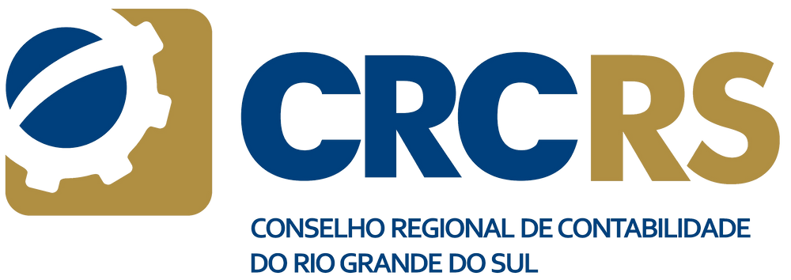

# Aplicativo de pesquisa e visualização 

## Descricão do Projeto

Este projeto foi desenvolvido com o objetivo de facilitar a pesquisa e a visualização de dados referentes a delegados e delegacias do Conselho Regional de Contabilidade do Rio Grande do Sul (CRCRS) e seus municípios de atividade. 

> Os dados são abertos e disponibilizados no site do [CRCRS](https://www.crcrs.org.br/).

## Descrição do Aplicativo

O aplicativo desenvolvido no ambiente [Streamlit](https://crcrs-delegados.streamlit.app/) permite a pesquisa de delegados e delegacias do CRCRS e seus municípios de atividade através de **filtros de pesquisa** e **visualizacão gráfica em mapa interativo**.

O aplicativo é composto por três seções: **Pesquisa**, **Mapa RS** e **Pesquisa no Mapa**.

Selecionando a seção **Pesquisa**, é possível pesquisar por município, delegacia ou delegado e isso retornará as informações correspondentes.

Ao selecionar a seção **Mapa RS**, será exibido o mapa do estado do Rio Grande do Sul colorido conforme as 103 delegacias registradas.

> No mapa, ao passar o cursor do mouse sobre cada município, serão exibidas as informações de cada um.

Na última seção, **Pesquisa no Mapa**, é possível selecionar a opção de pesquisa de seu interesse e o município correspondente estará com seu limite destacado em vermelho no mapa.

Mais informações em [CRCRS](https://www.crcrs.org.br/).

